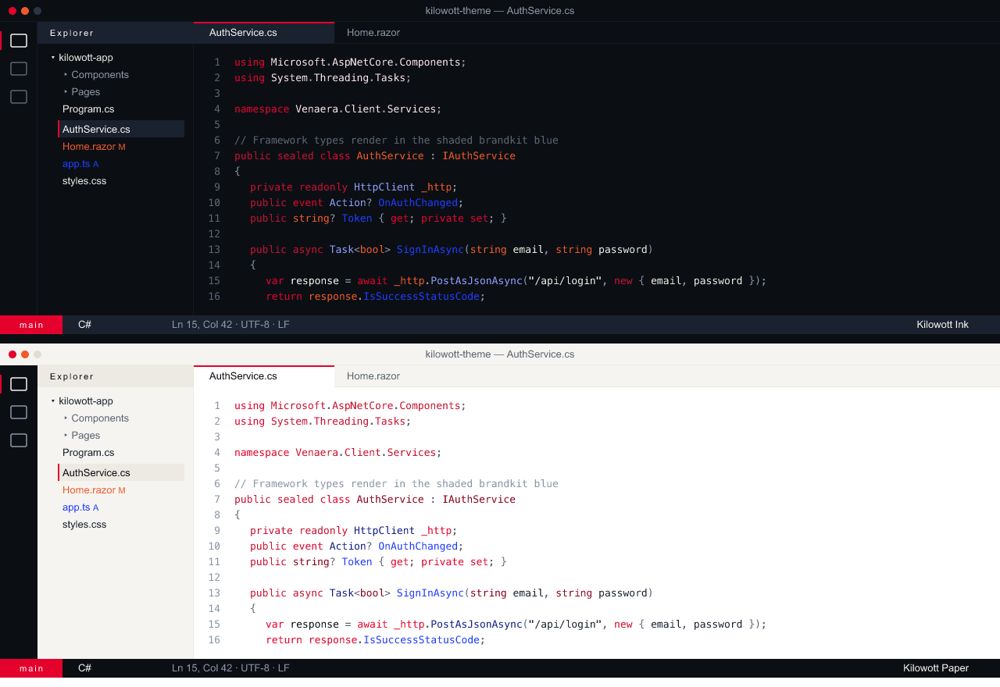

# Kilowott Theme

A VSCode theme built from the [Kilowott brand design tokens](https://brandkit.kilowott.com/project/) — Newsroom ink & paper with the signature red `#E4022D`.

Two variants ship in this extension:

- **Kilowott Ink** — dark mode on `#0B0F14` ink
- **Kilowott Paper** — light mode on warm `#FFFFFF` / `#F6F4F0` paper

## Preview



## Install

From a packaged `.vsix`:

```sh
code --install-extension kilowott-theme-0.1.0.vsix
```

Then open the Command Palette → **Preferences: Color Theme** → pick **Kilowott Ink** or **Kilowott Paper**.

## Palette

| Token | Hex |
| --- | --- |
| Ink | `#0B0F14` |
| Ink-2 | `#1A2230` |
| Ink-3 | `#2B3544` |
| Paper | `#FFFFFF` |
| Paper-2 | `#F6F4F0` |
| Paper-3 | `#EDEAE3` |
| Signature red | `#E4022D` |
| Deep red | `#C8102E` / `#8A021B` |
| Signal orange | `#F05A28` |
| Electric blue | `#1F3CFF` |
| Muted | `#5B6573` / `#8A95A5` |

Follows the brand 60 / 30 / 5 / 5 usage ratio: paper / ink / red / muted.
